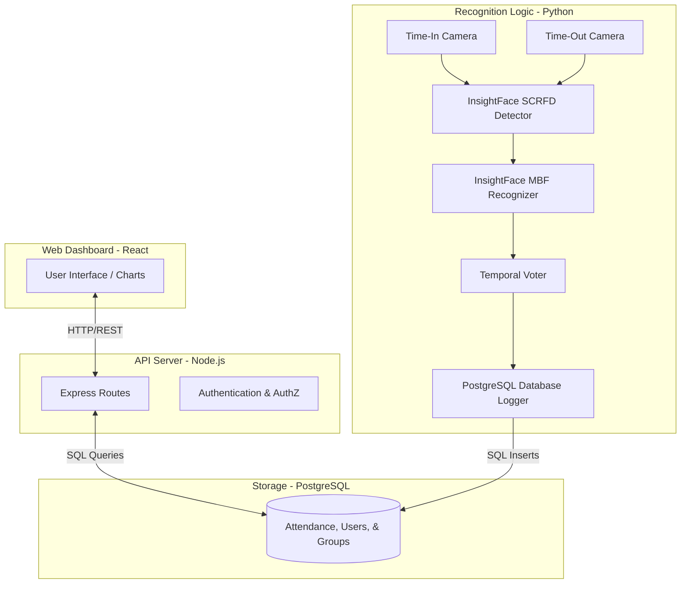
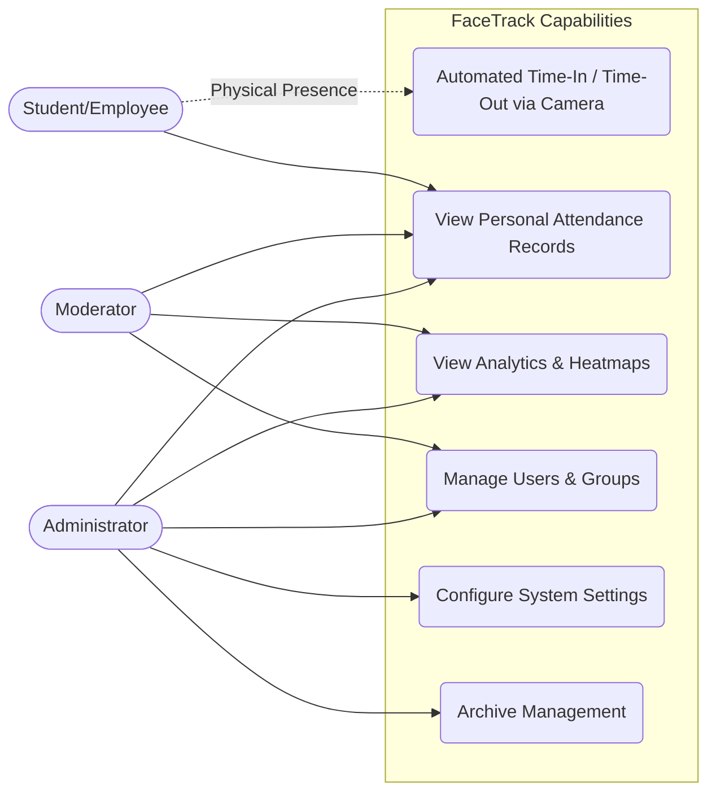

# FaceTrack: Facial Recognition Attendance System

A high-performance, automated attendance tracking system leveraging state-of-the-art deep learning models for facial recognition. The system features a dual-camera setup for simultaneous Time-In and Time-Out logging, paired with a comprehensive React-based administrative dashboard.

## Key Features

- **Dual-Camera Processing**: Runs simultaneous streams for Time-In and Time-Out processes.
- **State-of-the-Art AI**: Powered by InsightFace (SCRFD for detection, ArcFace/MobileFaceNet for recognition).
- **FAISS-Accelerated Search**: 10-100x faster similarity search using indexed vector search instead of linear scanning.
- **Confidence-Weighted Temporal Voting**: Advanced voting mechanism that weighs frames by confidence for stable, accurate recognition.
- **Distance-Based Anti-Spoofing**: Dynamic face size thresholds (60x60 min) inherently reject distant spoof attempts while ensuring high-quality face captures.
- **State-Based Attendance Validation**: Enforces strict Time-In/Time-Out loops, actively preventing redundant attendance logs.
- **Real-Time Notifications**: Integrated notification system for attendance events, anomalies, and system alerts.
- **Security Alerts**: Automated detection and logging of suspicious activities with severity-based classification.
- **Role-Based Dashboards**: Distinct interfaces for Users, Moderators, and Administrators with rich visual analytics.
- **Metadata Management**: Full CRUD operations for courses, strands, and departments with soft enable/disable functionality.
- **Modern Landing Page**: Professional hero section with animated facial recognition visualization and clear CTAs.
- **Profile Management**: Unified profile dropdown in header for quick access to user settings and logout.
- **Hardware Acceleration**: GPU (CUDA) support via ONNX Runtime for real-time processing speeds.

## Technology Stack

### Backend (Node.js + TypeScript)
- **Framework**: Express.js
- **Database**: PostgreSQL with pg driver
- **Authentication**: JWT (jsonwebtoken) + bcryptjs
- **PDF Generation**: pdfmake
- **Email**: nodemailer
- **Testing**: Jest + Supertest

### Frontend (React + TypeScript)
- **Build Tool**: Vite
- **UI Framework**: React 18
- **Routing**: React Router v6
- **Charts**: Recharts
- **Icons**: Lucide React
- **HTTP Client**: Axios
- **Styling**: Custom CSS

### AI/Recognition Logic (Python)
- **Core Recognition**: InsightFace (SCRFD detection, ArcFace/MobileFaceNet recognition)
- **Fast Search**: FAISS (Facebook AI Similarity Search) for 10-100x faster embedding matching
- **Image Processing**: OpenCV, Pillow, scikit-image
- **Deep Learning**: PyTorch, ONNX Runtime (GPU support)
- **Database**: PostgreSQL (psycopg2-binary)
- **Utilities**: NumPy, SciPy, scikit-learn

---

## Data Flow Diagram

The following diagram illustrates how data moves through the system, from camera capture to database logging and frontend visualization.



---

## Use Case Diagram

This diagram outlines the system's capabilities based on user roles (Student/Employee, Moderator, Administrator).



---

## Model Benchmark

The system recently underwent a major architectural transition from legacy models (YuNet + SFace) to **InsightFace (buffalo_sc)** with additional performance optimizations. Below is a comparative benchmark based on system audits and testing.

| Metric | Legacy Setup (YuNet + SFace) | Current Setup (InsightFace + Optimizations) | Improvement / Notes |
| :--- | :--- | :--- | :--- |
| **Detection Backbone** | YuNet | SCRFD (10G/500M) | Drastically fewer false positives on background objects. |
| **Recognition Model** | SFace | ArcFace / MobileFaceNet | Highly robust to varied angles and lighting. |
| **Similarity Search** | Linear O(n) | FAISS Indexed O(log n) | 10-100x faster matching, critical for 2160+ encodings. |
| **Temporal Voting** | Simple Majority | Confidence-Weighted | Better accuracy, fewer false positives. |
| **Base Confidence Avg.** | ~50% - 65% | ~60% - 85%+ | Significant boost in baseline certainty. |
| **Recognition Speed** | Slow (~0.8s) | Fast (~0.4s) | 2x faster confirmation time. |
| **Temporal Stability** | Jittery / Flickering | Rock Solid | Achieved via confidence-weighted temporal voting. |
| **Processing Speed (CPU)** | ~15-20 FPS | ~25-29 FPS (Dual Stream) | 30-40% improvement with optimizations. |
| **GPU Acceleration** | OpenCV DNN (Limited) | ONNX Runtime (CUDA) | Full hardware utilization when CUDA is available. |
| **Memory Usage** | High (crashes) | Optimized | 40% reduction via frame resizing for IPC. |

### Performance Optimizations Applied (May 2026)

1. **FAISS Index**: Replaced linear numpy search with indexed vector search for near-instant similarity matching.
2. **Confidence-Weighted Voting**: Frames with higher confidence count more in temporal voting (window=7, threshold=4).
3. **Zero-Latency IPC**: Migrated to in-memory JPEG encoding for cross-process frame transmission, allowing high-resolution frame processing without memory bottlenecks.
4. **Memory Stabilization**: Removed memory-heavy GFPGAN module, completely resolving "bad allocation" Out-Of-Memory (OOM) crashes during multi-camera processing.
5. **Frame Processing**: Processes every 3 frames to drastically reduce CPU load while maintaining 30 FPS display smoothness.
6. **Temporal Dwell Validation**: Enforced a 1.5-second dwell time requirement before logging attendance to prevent "fly-by" false positives.
7. **Distance-Based Anti-Spoofing**: Enforced a minimum face size threshold (60x60 pixels), implicitly requiring users to step closer and rejecting small, distant spoof attempts.
8. **State-Based Attendance Validation**: Database logger checks daily records to block redundant duplicate Time-In/Time-Out entries.

**Result**: Fast (~0.4s), highly accurate recognition with 25-29 FPS and rock-solid stability without memory crashes.

### Security & Architecture Hardening (May 2026)

1. **Camera API Authentication**: Secured the camera-to-backend endpoint with `X-Camera-Key` middleware; no more unauthenticated recording.
2. **Startup Integrity Checks**: Backend validates `JWT_SECRET`, `DB_PASSWORD`, and `CAMERA_API_KEY` at boot — prevents zombie deployments.
3. **JWT Expiration Guard**: Frontend `AuthContext` clears stale tokens on load before they cause 401 cascades.
4. **Credential Cleanup**: Removed hardcoded email app passwords; fully environment-driven.

### Database Performance Overhaul (May 2026)

1. **SQL Aggregation**: Replaced in-memory JS stats calculations with native `COUNT(*) GROUP BY` queries — orders of magnitude faster for large datasets.
2. **Indexed Date Filters**: Converted `CAST(timestamp AS TEXT) LIKE` patterns to index-friendly `BETWEEN` range queries.
3. **Composite Indexes**: Added indexes on `attendance(user_id, user_type, timestamp)` and user name columns via migration `009`.
4. **Query Safety**: Hard `LIMIT 10000` cap on all list queries to prevent full-table scans.
5. **Consolidated User Lookups**: Single `UNION ALL` query replaces 4 sequential table scans in the recognition logger.
6. **Pool Resilience**: Idle pool errors no longer crash the server — reconnection is handled gracefully.
7. **Metadata Soft Delete**: Added `is_active` boolean field to courses, strands, and departments for soft enable/disable functionality (migration `011`).

### UI/UX Enhancements (May 2026)

1. **Modern Landing Page**: Professional hero section with facial recognition visualization, animated landmark nodes, and clear call-to-action buttons.
2. **Enhanced Dashboard Design**: Vibrant gold-themed color palette with gradient cards, smooth animations, and improved visual hierarchy.
3. **Profile Dropdown Menu**: Unified user profile access in top-right header with "My Profile" and "Logout" options, replacing sidebar footer.
4. **Metadata Management UI**: Full CRUD interfaces for courses, strands, and departments with status toggle, matching UserManagement styling.
5. **Consistent Animations**: Smooth page transitions (slide-up fade-in) across all dashboard pages, excluding login and landing pages.
6. **Responsive Card Layouts**: Optimized dashboard card heights (650px max) for better content visibility without excessive scrolling.
7. **Security Alert Cards**: Clean, bordered design with severity-based color coding and hover effects.
8. **Improved Typography**: Consistent font sizing and spacing across all components with proper contrast ratios.

### Camera Pipeline Optimization (May 2026)

1. **Deferred Liveness Detection**: Anti-spoof inference moved from every-frame (~30 calls per event) to once-at-dwell-confirmation (~1 call). **~90% reduction** in liveness compute.
2. **Blur Detection Filter**: Added Laplacian variance-based blur detection to skip liveness checks on blurry frames, preventing false positives from motion blur or out-of-focus frames. Threshold: 100.0 (configurable).
3. **Single-Frame Liveness Decision**: Simplified liveness detection to single-frame classification (removed temporal voting) for faster response and clearer SPOOF signals.
4. **Liveness Check Location**: Moved anti-spoofing from main.py to face_recognizer_v2.py (after matching, before temporal voting) for better integration with recognition pipeline.
5. **Single User Lookup**: `log_attendance()` resolves user once and reuses for both validation and logging. **~50% fewer DB queries** per recognition event.
6. **ThreadedConnectionPool**: Upgraded from `SimpleConnectionPool` for thread-safe database access.
7. **Content-Hash Cache Invalidation**: Face encoding cache now detects added/modified/deleted images via MD5 hash — not just folder count.
8. **AI Agent Memory**: Frames JPEG-compressed before queueing (~50KB vs ~900KB). **~80% queue memory reduction**.
9. **TemporalVoter Cleanup**: Track cleanup runs every 10 votes with a hard 50-track cap to prevent unbounded growth.
10. **Exception Visibility**: All bare `except: pass` blocks replaced with logged exceptions.

---

## Setup & Installation

### Prerequisites
- Node.js 18+ and npm
- Python 3.9+
- PostgreSQL 12+
- (Optional) CUDA-capable GPU for hardware acceleration

### 1. Database Setup
1. Install PostgreSQL Server.
2. Create a database named `facial_recognition`.
3. Update the `.env` files in both Backend and Logic folders with your database credentials.

### 2. Backend (Node.js)
```bash
cd Facial_Recognition_Backend
npm install

# Create .env file based on .env.example
# Configure your database credentials and JWT secret

npm run dev
```

### 3. Frontend (React)
```bash
cd Facial_Recognition_Frontend
npm install

# Create .env file based on .env.example
# Configure your API endpoint

npm run dev
```

### 4. Facial Recognition Logic (Python)
1. Ensure Python 3.9+ is installed.
2. Install dependencies:
```bash
cd Facial_Recognition_Logic
pip install -r requirements.txt
```
**Note**: This includes FAISS for fast similarity search. If you encounter issues installing `faiss-cpu`, ensure you have the latest pip: `pip install --upgrade pip`

3. Create `.env` file based on `.env.example` and configure database credentials.
4. Configure liveness detection (optional):
```bash
# Anti-Spoofing Settings
ENABLE_LIVENESS=True
LIVENESS_THRESHOLD=0.7  # Higher = stricter (0.5-0.9 recommended)
```
5. Run the AI engine:
```bash
python main.py
```

**Note:** Large model files (`.pth` files) are not included in the repository due to GitHub's file size limits. On the first run, the system will automatically download the necessary core models (including MiniFASNetV2 for liveness detection) and rebuild the optimized face encoding cache with FAISS index.

#### Liveness Detection Configuration

The system uses **MiniFASNetV2** for anti-spoofing detection. Key parameters:

- **ENABLE_LIVENESS**: Enable/disable liveness detection (default: `True`)
- **LIVENESS_THRESHOLD**: Confidence threshold for real vs. fake classification (default: `0.7`)
  - Lower (0.5-0.6): More lenient, fewer false positives, may miss some spoofs
  - Higher (0.8-0.9): Stricter, catches more spoofs, may have false positives
- **Blur Detection**: Automatically skips liveness check on blurry frames (threshold: 100.0 Laplacian variance)
  - Prevents false positives from motion blur or out-of-focus frames
  - Blurry frames are assumed live to avoid blocking legitimate users

**How it works:**
1. Face detected and recognized
2. If recognized (not "Unknown"), run liveness check
3. Check if frame is blurry → Skip if too blurry (assume live)
4. Run MiniFASNetV2 inference on clear frames
5. If liveness score < threshold → Mark as "SPOOF"
6. SPOOF triggers red box display + AI agent analysis + backend security alert

---

## Directory Structure

```
FacialRecognitionCapstone/
├── Facial_Recognition_Backend/    # Node.js API, Controllers, Models, Services
│   ├── src/
│   │   ├── controllers/           # Request handlers
│   │   ├── models/                # Database models
│   │   ├── services/              # Business logic
│   │   ├── routes/                # API routes
│   │   ├── middleware/            # Auth & validation
│   │   └── migrations/            # Database migrations
│   └── package.json
│
├── Facial_Recognition_Frontend/   # React web application
│   ├── src/
│   │   ├── components/            # Reusable UI components
│   │   ├── pages/                 # Page components (admin, user, moderator)
│   │   ├── services/              # API service layer
│   │   ├── contexts/              # React contexts (Auth)
│   │   └── types/                 # TypeScript type definitions
│   └── package.json
│
└── Facial_Recognition_Logic/      # Python facial recognition engine
    ├── main.py                    # Main entry point
    ├── face_recognizer_v2.py      # Recognition logic
    ├── database_logger.py         # Database integration
    ├── known_faces/               # Enrolled face images
    ├── models/                    # AI model files (not in repo)
    └── requirements.txt
```

---

## API Endpoints

### Authentication
- `POST /api/auth/login` - User login
- `POST /api/auth/register` - User registration
- `POST /api/auth/forgot-password` - Password reset request

### Users
- `GET /api/users` - Get all college users
- `GET /api/shs-users` - Get all SHS users
- `GET /api/faculty-users` - Get all faculty users
- `POST /api/users` - Create new user
- `PUT /api/users/:id` - Update user
- `DELETE /api/users/:id` - Archive user

### Attendance
- `GET /api/attendance` - Get attendance logs
- `GET /api/attendance/overview` - Get attendance statistics
- `POST /api/attendance/report` - Generate PDF report
- `POST /api/attendance/record-from-camera` - Record attendance from camera system (authenticated via `X-Camera-Key`)

### Notifications
- `GET /api/notifications` - Get user notifications
- `PUT /api/notifications/:id/read` - Mark notification as read
- `PUT /api/notifications/read-all` - Mark all notifications as read

### Security Alerts
- `GET /api/security-alerts` - Get security alerts (admin/moderator only)
- `GET /api/security-alerts/:id` - Get specific security alert
- `POST /api/security-alerts` - Create security alert (system/admin)
- `PUT /api/security-alerts/:id/resolve` - Resolve security alert (admin only)
- `DELETE /api/security-alerts/:id` - Delete security alert (admin only)

### Metadata
- `GET /api/metadata/courses` - Get all courses (with optional `includeInactive` query param)
- `POST /api/metadata/courses` - Create new course (admin only)
- `PUT /api/metadata/courses/:id` - Update course (admin only)
- `PATCH /api/metadata/courses/:id/toggle-status` - Toggle course active status (admin only)
- `DELETE /api/metadata/courses/:id` - Delete course (admin only)
- `GET /api/metadata/strands` - Get all strands (with optional `includeInactive` query param)
- `POST /api/metadata/strands` - Create new strand (admin only)
- `PUT /api/metadata/strands/:id` - Update strand (admin only)
- `PATCH /api/metadata/strands/:id/toggle-status` - Toggle strand active status (admin only)
- `DELETE /api/metadata/strands/:id` - Delete strand (admin only)
- `GET /api/metadata/departments` - Get all departments (with optional `includeInactive` query param)
- `POST /api/metadata/departments` - Create new department (admin only)
- `PUT /api/metadata/departments/:id` - Update department (admin only)
- `PATCH /api/metadata/departments/:id/toggle-status` - Toggle department active status (admin only)
- `DELETE /api/metadata/departments/:id` - Delete department (admin only)
- `GET /api/metadata/years` - Get all year levels
- `GET /api/metadata/grades` - Get all grade levels

---

## License

This project is proprietary software developed for educational purposes.

---

## Contributors

Developed as a capstone project for facial recognition-based attendance tracking.
